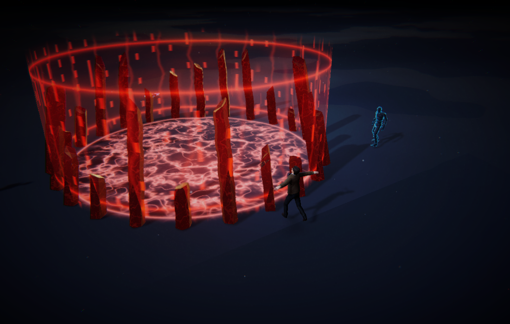
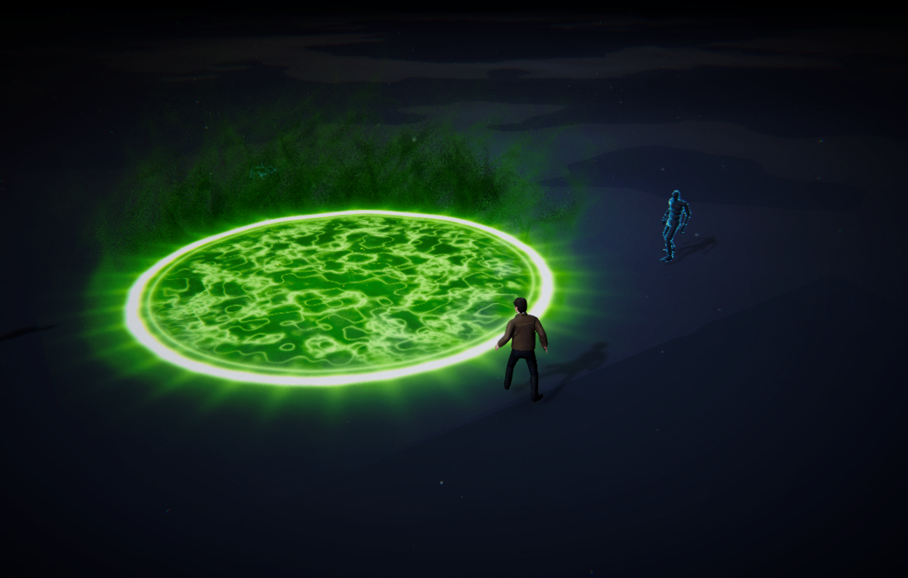
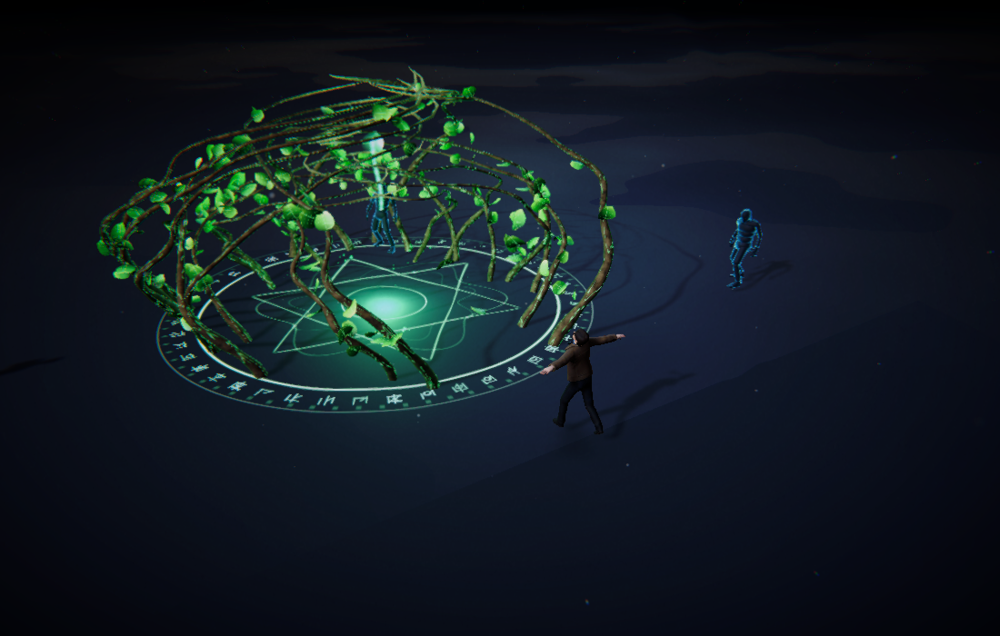
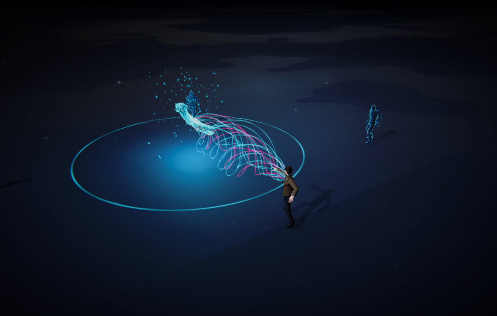
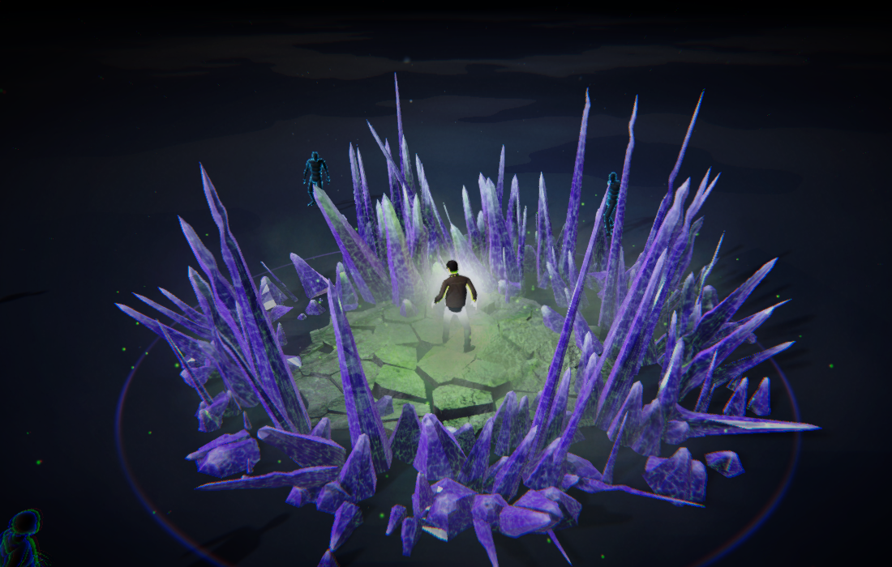
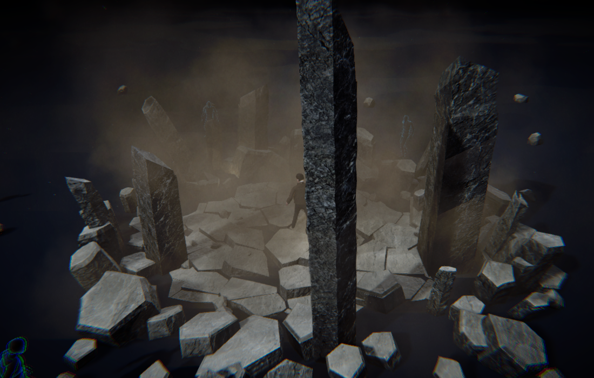
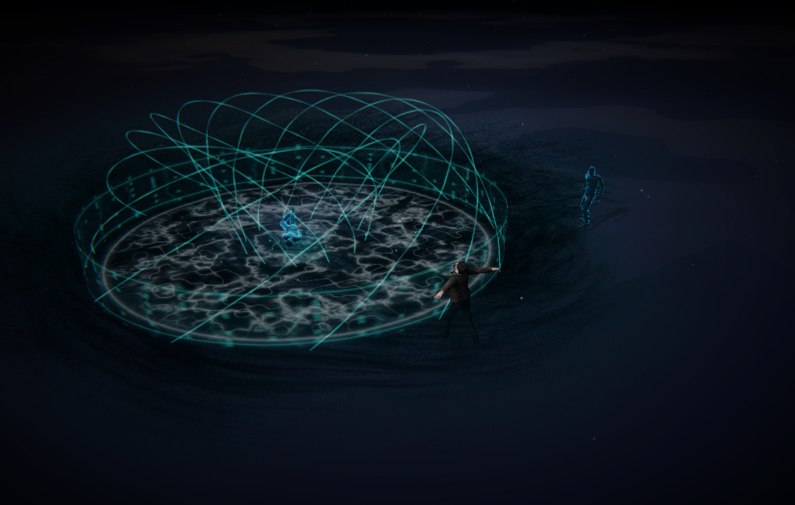
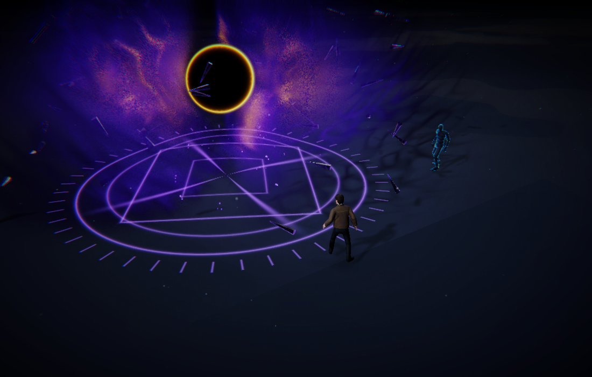
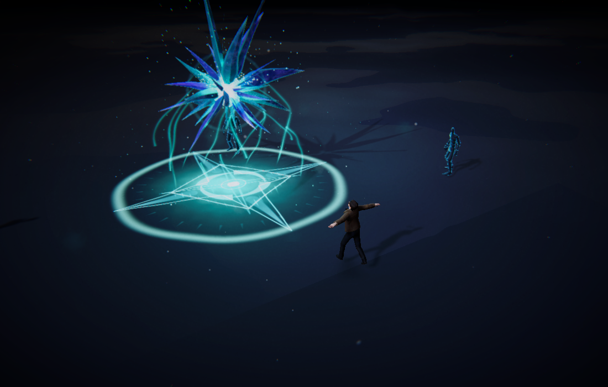
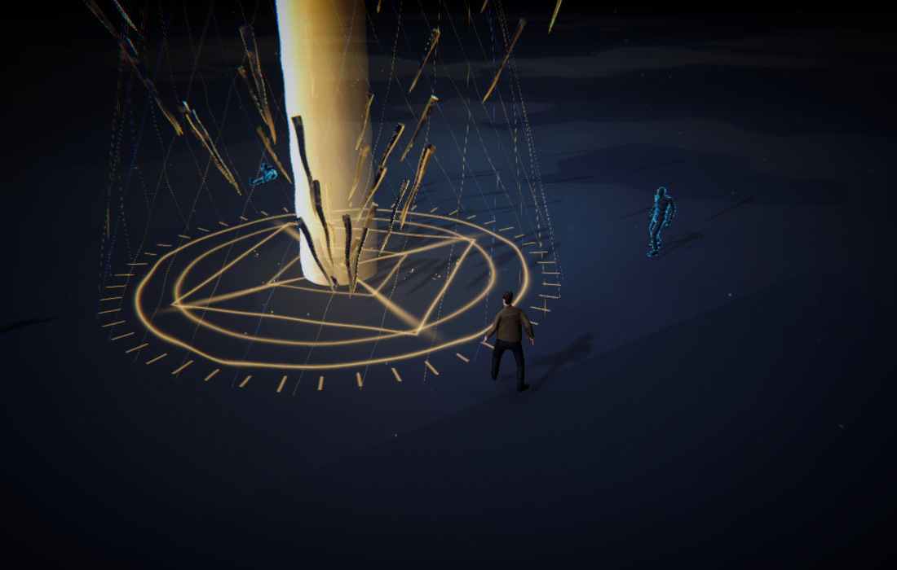

# Elemental Sandbox — Unity

Native Unity 6000.5.1f1 / URP 17 project, ported from the Three.js Elemental Sandbox.

Open **Assets/ElementalSandbox/Scenes/ElementalSandbox.unity** and press **Play**.
If the scene needs to be regenerated, use **Elemental Sandbox → Create or open sandbox scene**.

## Screenshots

Captures written by **Elemental Sandbox → Run visual smoke test**, rendered through the same URP pipeline the player uses. Click an image to view it at full size.

| Volcanic Horror Ward | Caustic Bloom |
| --- | --- |
| [](Validation/Screenshots/01-ward.png) | [](Validation/Screenshots/02-acid.png) |

| Arborist's Growth | Cyber Serpent |
| --- | --- |
| [](Validation/Screenshots/03-growth.png) | [](Validation/Screenshots/04-cyber.png) |

| Crystallized Venom Surge | Monolith Rift |
| --- | --- |
| [](Validation/Screenshots/05-venom.png) | [](Validation/Screenshots/06-quake.png) |

| Sumi Tide | Cosmic Singularity |
| --- | --- |
| [](Validation/Screenshots/07-ink.png) | [](Validation/Screenshots/08-astral.png) |

| Baleful Cascade | Judgment Cascade |
| --- | --- |
| [](Validation/Screenshots/09-cascade.png) | [](Validation/Screenshots/10-rend.png) |

## Controls

| Action | Desktop | Touch |
|---|---|---|
| Select ability | Q E R F V X B Z N K, or 1–0 | Tap an ability card |
| Aim and cast | Mouse, then left click | Tap the ground after selecting |
| Orbit | Right drag | Two-finger drag |
| Zoom | Scroll | Pinch |
| Cancel | Escape / right click | Choose another card |
| Editor / pause / clear / reset targets | G / P / C / T | Onscreen buttons |

The seven ground casts use a circle and Cyber Serpent a line arrow. **Venom Surge and Monolith Rift are guard casts**: no aim — click anywhere and the eruption rings the caster at `guardRadius` (venom 3.6 m, rift 4.5 m), the front sweeping the circle from where the body faces, the burst rising at the centre, and anything inside the ring struck as the front passes its bearing. This is a deliberate departure from the source, where both are line casts. At most four casts remain active. Per-ability pools reuse visual objects. Targets use the original FBX with articulated Unity physics and respawn after dissolving.

## Port contents and fidelity

- Ten playable abilities, original names, keys, ranges, cooldowns and timings.
- Original character, idle animation, three cast animations, target model, stone textures, HDR reference, and HUD sigils.
- Twenty-seven meshes exported from the original geometry code, including the canonical Cyber Serpent mesh.
- Native C# effects, custom URP shaders, raymarched gas/nebula, bloom, and frame distortion after transparent rendering.
- The source's stage: HDR image-based lighting, its colour grade, its ambient dust and its contact shadow. See *The look layer* below.
- Live editing for the implemented parameters, simulation pause, local preset save/load, clipboard import/export with validation, and graphics presets.
- Camera rendering checked in desktop, landscape and portrait aspect ratios.

**The stage matches the source, and the volumes now do too; the rest of the abilities are still reconstructions.** The remaining GLSL materials were rebuilt in HLSL, and their detailed noise, shading, geometry animation and composition still differ. The growth and cascade attack motion, ink/astral body handling, physical debris, and shader layering are approximations. Growth cuts a baked copy of the target mesh into two capped physical pieces. The original editor's full parameter coverage and performance comparison panel have not been reproduced.

All **2,696 source setting values** are preserved in `Resources/Elemental/Defaults.json`, with the original nested settings in `OriginalSettings.json`. The whole `environment.*` and `post.*` blocks are now read every frame; `post.distortion` and `post.flashStrength` are not, and `environment.shadowBias` / `environment.shadowRadius` stay on Unity's own shadow units rather than three's. Elsewhere, only parameters exposed in the Unity live editor are guaranteed to affect the port. Unity presets use the native flat schema and are not interchangeable with Three.js preset files.

`SourceReference/ThreeJS/` preserves the source implementation for the remaining fidelity work. It is outside Assets and excluded from the game build. No browser or embedded webpage runs the game.

## The look layer

The first pass of this port carried the abilities across and left the stage
behind: two directional lights on a flat colour, a bloom and a vignette. Every
value it needed was already sitting unread in `Defaults.json`. `ElementalLook`
now spends them, and the four pieces it restores are most of what separated the
two builds visually.

| Source | Unity |
|---|---|
| `Environment.js` — `scene.environment` at `envIntensity` | `spruit_sunrise.hdr` reimported as a linear cubemap with glossy convolution, convolved to SH once at boot and set as `customReflectionTexture`. The ambient and hemisphere fills are summed into the same probe, which Unity has no hemisphere light for. |
| `GradeShader.js` | Exposure, contrast, saturation, lift/gain, temperature, vignette, grain and chromatic aberration, mapped onto URP's volume components. Each conversion is written down at the line that performs it. |
| `DustMotes.js` | 2,600 motes on one draw call, drift and curl and twinkle in the vertex shader. The source sizes GL points in pixels; Metal will not, so each mote is a billboard whose world size is derived from the same pixel size. |
| `ContactShadows.js` | The caster's depth from below into a 256px target, blurred twice at the source's two radii, projected on the floor at `shadowFps`. |

`Elemental/Ground` also goes through URP's BRDF now rather than a hand-rolled
lambert, so the floor picks up the probe, its normal/roughness/AO maps and the
`floorSheen` break-up the source patches into `MeshStandardMaterial`.

Bloom is the one number that moved the other way: the port ran it at a flat
`0.45`, and the source keeps `bloomStrength` at `0.03` on purpose — the glow in
the reference frames is emissive geometry, not the bloom chain — so the port was
washing its own silhouettes out.

What still differs is the abilities themselves, which is what the fidelity note
above describes.


## The ported materials

Ported from the source material of the same name, parameter for parameter,
rather than approximated by the shared `Elemental/Volume`:

| Source | Unity | What the shared march was missing |
|---|---|---|
| `ToxicMistMaterial.js` (mist) | `Elemental/AcidMist` | The chimney profile, the lobed wall, ridged filaments, the climbing tear threshold, and lighting from *below* — the pool is the key light and it sits under the gas. |
| `ToxicMistMaterial.js` (ring) | `Elemental/AcidRing` | A three-layer SDF annulus whose core is allowed to blow past 1, which is what reads white against the green. The port drew the boundary in the pool's own colour. |
| `AstralNebulaMaterial.js` | `Elemental/Nebula` | Spiral arms on a radius-dependent shear, the straight golden spears on an *unwound* bearing, doppler beaming, the oblate envelope, and the spherical eye round the horizon. |
| `InkVolumeMaterial.js` | `Elemental/InkVolume` | The funnel's eye, differential winding, lighting from above, and standing the pigment back from the bodies the tide is holding. |
| `ObsidianMaterial.js` | `Elemental/Obsidian` | Flat-shaded volcanic glass over a `glassRough` PBR base, with the lava veins read at two depths along the view ray so they sit inside the stone, the facet tint, the cavity, and the beat flash climbing the monolith. |
| `MonolithRiftAbility.js` dust | `SourceEruptionParticles` | The four dust beats with the source's own numbers — the front, the impact plume, the twenty-jet rolling ring at `ringSpeed`, and the settle — emitted through a line-for-line port of `ParticleSystem.emit()`. Unity's drag module had to stop scaling drag by size and speed, or a 3 m puff leaving at 11 m/s stopped where it was born. |
| `ParticleSystem.js` smoke | `Elemental/SourceSmoke` | `lit: true` (a wrapped diffuse against the key, so a puff has a lit side) and the rift's 1.6 m soft fade. |
| `LightPool.js` + `Ability._updateLight` | four pooled URP point lights in `ElementalApp` | Every cast lights floor, stone, character and targets in its own `lightColor` at `lightIntensity`, with the impact `lightBoost`, the shimmer and the three phase scales. The port had an ad-hoc floor-only term in the accent colour at a flat intensity. Forward+ needed `_CLUSTER_LIGHT_LOOP` on `Ground`, `Surface` and `Obsidian` before any of it reached a surface. |
| `GroundDecals.js` | `Elemental/GroundDecal` + `SourceDecals` | All eight decal kinds behind one fragment; the rift's four spawn sites (cast, front trail every `1/scarRate` m, impact ring, shockwave) are wired. The other nine abilities' 41 spawn sites are still to port. |

Venom and the Monolith Rift have **no** volume: their gas and dust are
`ParticleEngine` emitters in the source, and the generic march the port built
for them was created and then switched straight back off in `Eruption()`. It is
gone, and `SourceEruptionParticles` carries them as the source intends.

`SourceNoise.hlsl` already held the Ashima simplex these all rely on, so none of
them needed new noise.

**The rift's dust carries a measured correction.** The source was driven headless
(Chrome over CDP on Metal, `window.app.abilities.cast(...)`) and photographed at
the same instants as the smoke test. Both builds hold ~780 dust sprites of the
same size, lifetime and per-sprite alpha at 1.8 s — a lone 6 m puff at opacity
1 renders identically in both — yet the source's cloud is about six times
denser. Soft fade, drag, the size curve, the mask and the colour space were each
ruled out in isolated runs; `RiftDustCalibration` in `SourceEruptionParticles`
reproduces the measured density until the mechanism is found.

`Elemental/Surface` — the stand-in for the remaining patched
`MeshStandardMaterial`s (VoidShard, RendShard, the dummy, the serpent) — now runs
its five looks over `UniversalFragmentPBR` with each source material's roughness,
metalness and flat shading, instead of `lambert * .75 + .1`. That was why every
solid read as painted plastic beside the source: no specular, no environment,
no roughness. The VoidShard and RendShard *looks* themselves are still the
port's approximations.


## Desktop focus

Current development and validation target macOS desktop. Mobile development is paused. The native desktop build is `Builds/macOS/ElementalSandbox.app`.

The missing stone/crystal bug in the initial native build was caused by instancing shader variant stripping. `ProjectSettings/GraphicsSettings.asset` now preserves these variants. `Validation/NativeDesktop/` holds captures from the actual compiled player; they predate the look layer described above. For the same reason no stage code reaches for a built-in shader by name — `Elemental/SkyProbe` lives under `Resources/` so the player cannot strip the probe out from under the lighting.

## Builds and verification

The **Elemental Sandbox** menu contains macOS, Windows, Android and iOS build commands. Install the relevant Unity build-support module before building. iOS produces an Xcode project and needs your signing setup for installation. Device performance and touch behavior still need testing on physical Android/iOS hardware; desktop aspect-ratio renders are not device tests.

- `Elemental Sandbox → Validate port assets`: source geometry/model/shader checks and atomic invalid-preset rejection.
- `Elemental Sandbox → Run visual smoke test`: renders all ten abilities, checks the four-cast cap, and captures desktop/mobile aspect ratios.
- Reports and screenshots are written to `Validation/`.

Re-export source data with:

```sh
node Tools/export-source.mjs /absolute/path/to/LinearAbiltyCastingExtendedThreeJS
```

The source project must have its npm dependencies installed. The exporter resolves spaces in paths using `fileURLToPath`; it does not create a second percent-encoded project directory.

Original asset licensing remains applicable; see `SourceReference/ThreeJS/README.md`.


## Desktop effects update

Venom Surge and Monolith Rift now use the original distribution and animation formulas, dedicated HLSL materials, Voronoi ground plates, and separate gas, dust, and spray emitters. Directional lighting was corrected for the Three.js-to-Unity coordinate conversion. The macOS build and native runtime checks passed for this revision.

See [the eruption port notes](Validation/SourceEruptions.md) for implementation details and remaining visual differences.
