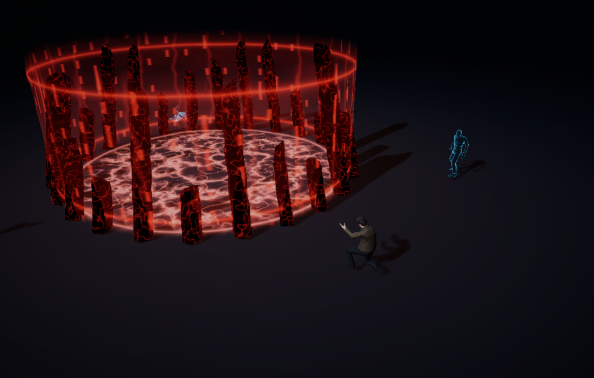
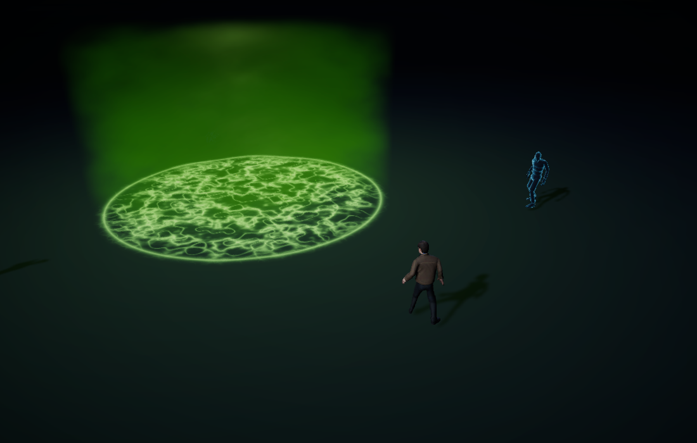
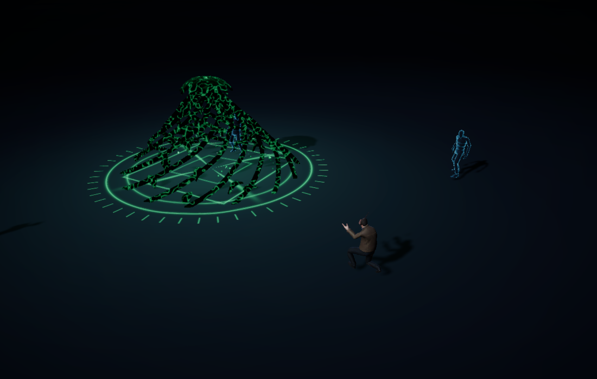
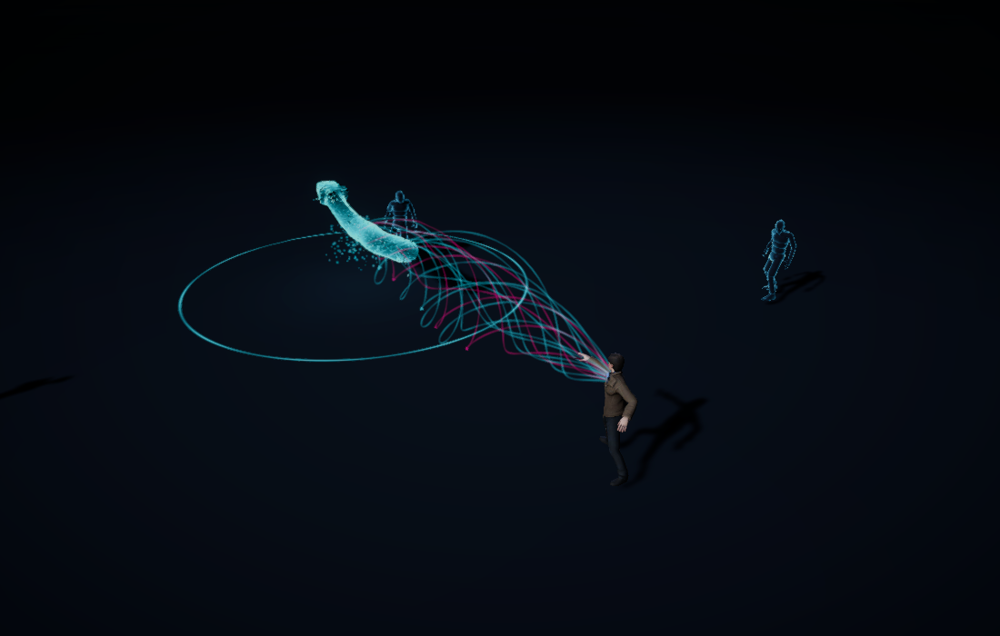
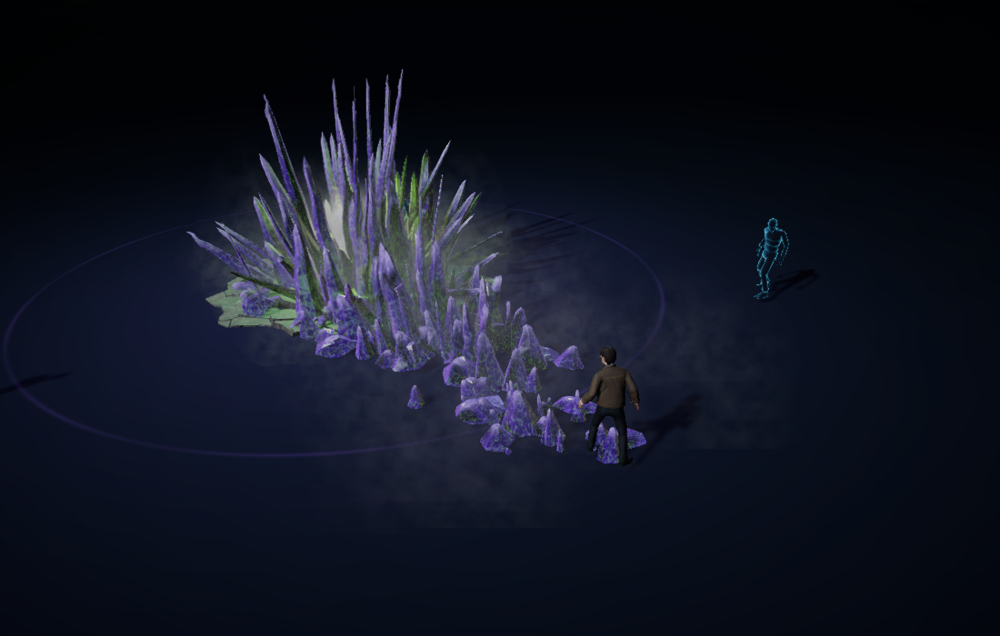
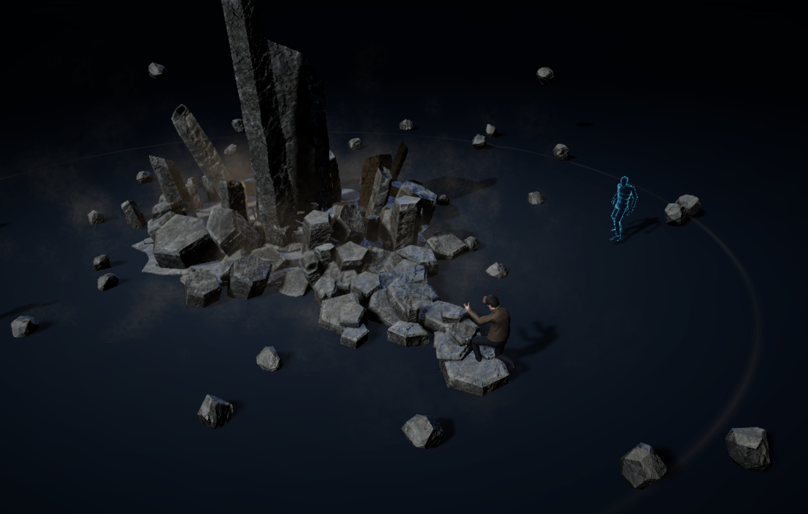
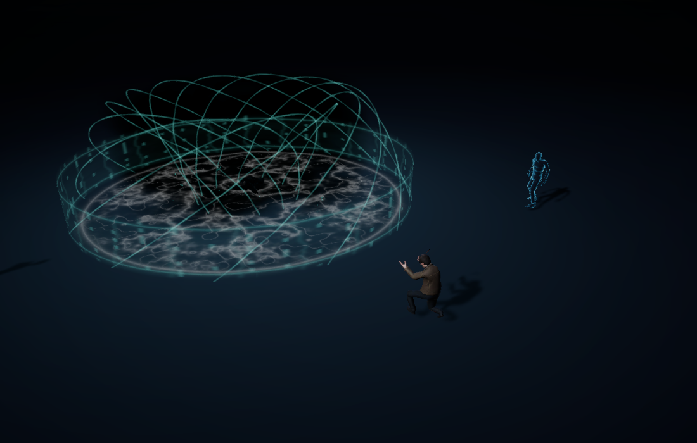
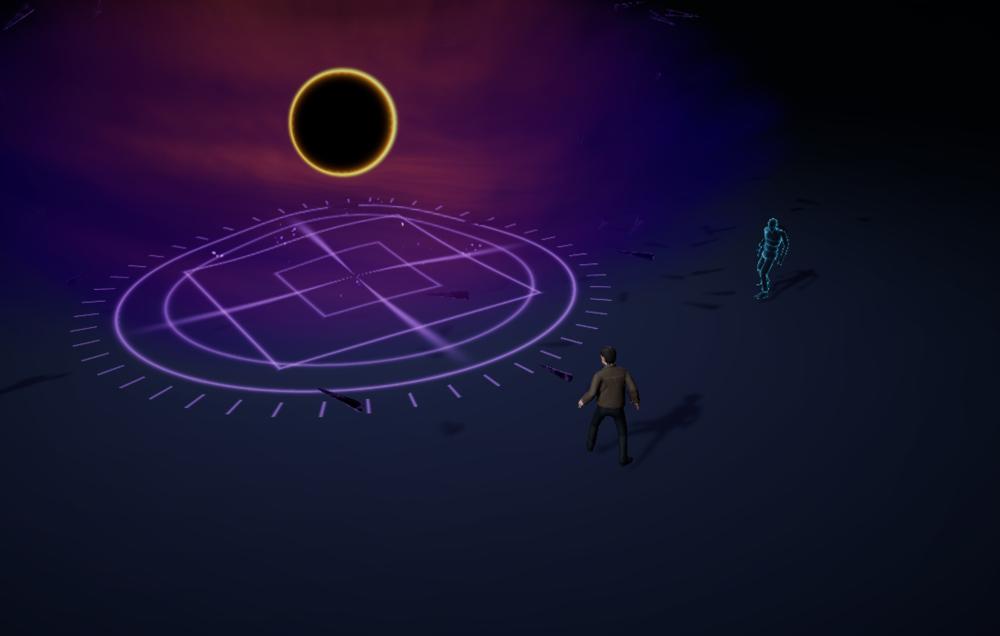
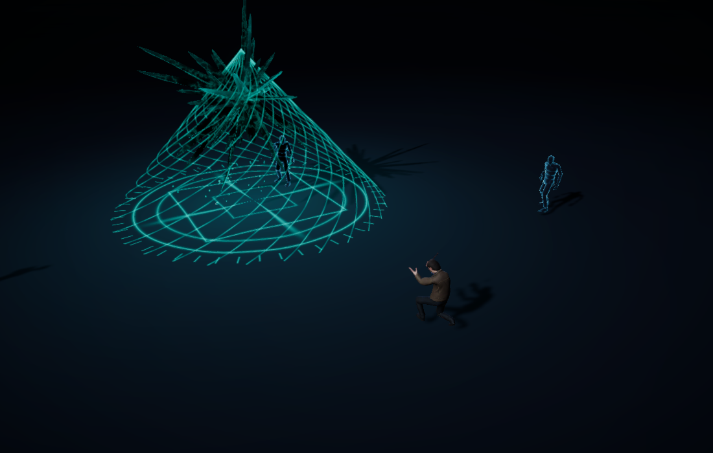
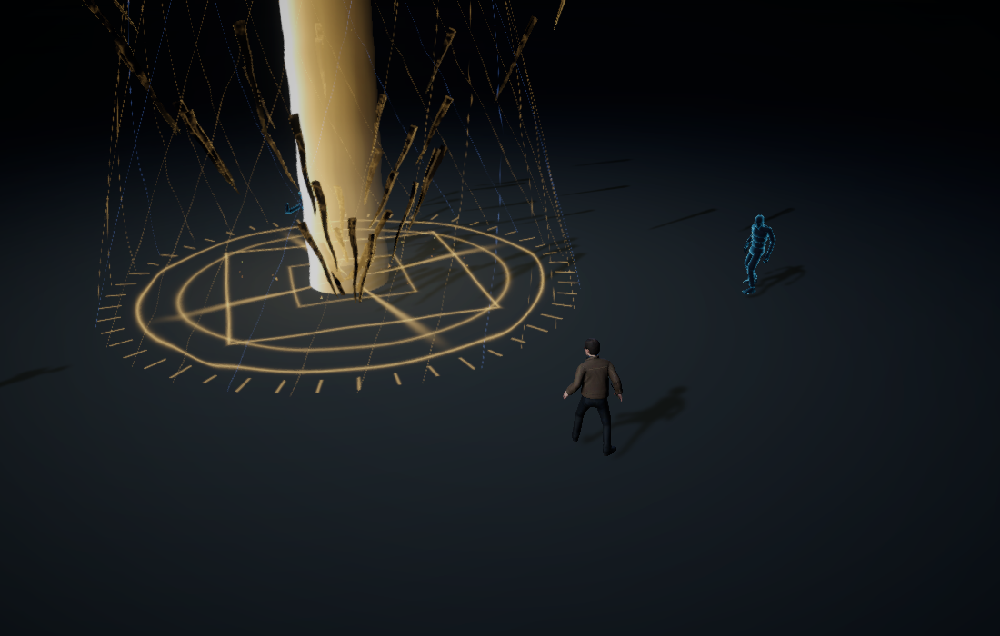

# Elemental Sandbox — Unity

Native Unity 6000.5.1f1 / URP 17 project, ported from the Three.js Elemental Sandbox.

Open **Assets/ElementalSandbox/Scenes/ElementalSandbox.unity** and press **Play**.
If the scene needs to be regenerated, use **Elemental Sandbox → Create or open sandbox scene**.

## Screenshots

Captures from the native macOS player. Click an image to view it at full size. These are saved validation captures; they may not reflect every subsequent visual change.

| Volcanic Horror Ward | Caustic Bloom |
| --- | --- |
| [](Validation/NativeDesktop/ward.png) | [](Validation/NativeDesktop/acid.png) |

| Arborist's Growth | Cyber Serpent |
| --- | --- |
| [](Validation/NativeDesktop/growth.png) | [](Validation/NativeDesktop/cyber.png) |

| Crystallized Venom Surge | Monolith Rift |
| --- | --- |
| [](Validation/NativeDesktop/venom.png) | [](Validation/NativeDesktop/quake.png) |

| Sumi Tide | Cosmic Singularity |
| --- | --- |
| [](Validation/NativeDesktop/ink.png) | [](Validation/NativeDesktop/astral.png) |

| Baleful Cascade | Judgment Cascade |
| --- | --- |
| [](Validation/NativeDesktop/cascade.png) | [](Validation/NativeDesktop/rend.png) |

## Controls

| Action | Desktop | Touch |
|---|---|---|
| Select ability | Q E R F V X B Z N K, or 1–0 | Tap an ability card |
| Aim and cast | Mouse, then left click | Tap the ground after selecting |
| Orbit | Right drag | Two-finger drag |
| Zoom | Scroll | Pinch |
| Cancel | Escape / right click | Choose another card |
| Editor / pause / clear / reset targets | G / P / C / T | Onscreen buttons |

The seven ground casts use a circle; Cyber Serpent, Venom Surge and Monolith Rift use a line arrow. At most four casts remain active. Per-ability pools reuse visual objects. Targets use the original FBX with articulated Unity physics and respawn after dissolving.

## Port contents and fidelity

- Ten playable abilities, original names, keys, ranges, cooldowns and timings.
- Original character, idle animation, three cast animations, target model, stone textures, HDR reference, and HUD sigils.
- Twenty-seven meshes exported from the original geometry code, including the canonical Cyber Serpent mesh.
- Native C# effects, custom URP shaders, raymarched gas/nebula, bloom, and frame distortion after transparent rendering.
- Live editing for the implemented parameters, simulation pause, local preset save/load, clipboard import/export with validation, and graphics presets.
- Camera rendering checked in desktop, landscape and portrait aspect ratios.

**This is a functional native port, not yet a visually identical reproduction.** The source GLSL materials were reconstructed in HLSL; their detailed noise, shading, geometry animation and composition still differ. The growth and cascade attack motion, ink/astral body handling, physical debris, and shader layering are approximations. Growth cuts a baked copy of the target mesh into two capped physical pieces. The original editor's full parameter coverage and performance comparison panel have not been reproduced.

All **2,696 source setting values** are preserved in `Resources/Elemental/Defaults.json`, with the original nested settings in `OriginalSettings.json`. Only parameters exposed in the Unity live editor are currently guaranteed to affect the port. Unity presets use the native flat schema and are not interchangeable with Three.js preset files.

`SourceReference/ThreeJS/` preserves the source implementation for the remaining fidelity work. It is outside Assets and excluded from the game build. No browser or embedded webpage runs the game.

## Desktop focus

Current development and validation target macOS desktop. Mobile development is paused. The native desktop build is `Builds/macOS/ElementalSandbox.app`.

The missing stone/crystal bug in the initial native build was caused by instancing shader variant stripping. `ProjectSettings/GraphicsSettings.asset` now preserves these variants. `Validation/NativeDesktop/` contains captures from the actual compiled player, including Venom Surge and Monolith Rift.

## Builds and verification

The **Elemental Sandbox** menu contains macOS, Windows, Android and iOS build commands. Install the relevant Unity build-support module before building. iOS produces an Xcode project and needs your signing setup for installation. Device performance and touch behavior still need testing on physical Android/iOS hardware; desktop aspect-ratio renders are not device tests.

- `Elemental Sandbox → Validate port assets`: source geometry/model/shader checks and atomic invalid-preset rejection.
- `Elemental Sandbox → Run visual smoke test`: renders all ten abilities, checks the four-cast cap, and captures desktop/mobile aspect ratios.
- Reports and screenshots are written to `Validation/`.

Re-export source data with:

```sh
node Tools/export-source.mjs /absolute/path/to/LinearAbiltyCastingExtendedThreeJS
```

The source project must have its npm dependencies installed. The exporter resolves spaces in paths using `fileURLToPath`; it does not create a second percent-encoded project directory.

Original asset licensing remains applicable; see `SourceReference/ThreeJS/README.md`.


## Desktop effects update

Venom Surge and Monolith Rift now use the original distribution and animation formulas, dedicated HLSL materials, Voronoi ground plates, and separate gas, dust, and spray emitters. Directional lighting was corrected for the Three.js-to-Unity coordinate conversion. The macOS build and native runtime checks passed for this revision.

See [the eruption port notes](Validation/SourceEruptions.md) for implementation details and remaining visual differences.
